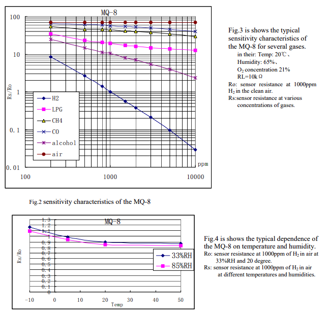
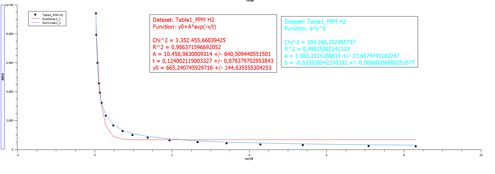
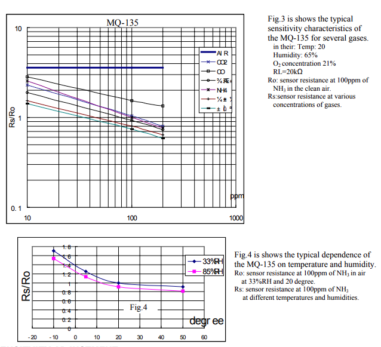
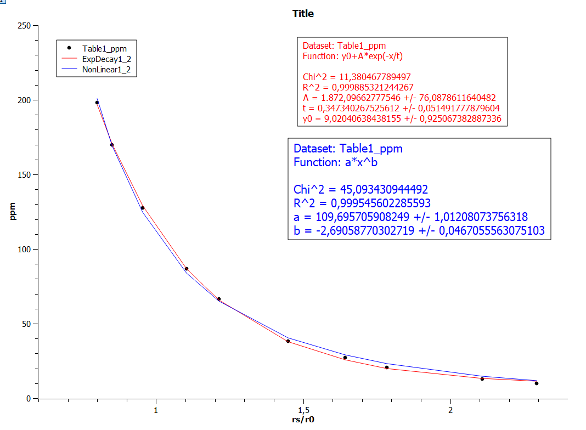

# MQSensor
Uma biblioteca para facilitar o uso de qualquer sensor MQ.  
Foram testados os sensore MQ8 e MQ135.  

# Metodologia 
1) Os dados dos sensores, disponibilizados através dos datasheets dos fabricantes, foram extraidos utilizando o site [WebPlotDigitizer](https://automeris.io/wpd/) e salvos em arquivos `csv`.  
    - Disponível em [Dados](/Dados/).   

2) Utilizando os dados salvos nos arquivos `csv`, regressões exponenciais e de potência foram feitas pelo programa [SciDavis](https://scidavis.sourceforge.net/).  
    - Disponível em [Regressão](/Regressão/).   

### MQ8 



### MQ135



# Código
Crie uma instância para cada sensor.  
```c++
MQ mqX(uint8_t analogPort, uint loadResistor, uint ratioInCleanAir);
```
O parametro `ratioInCleanAir` é o valor RS/R0 do sensor quando em ar puro, disponível dos datasheets de cada sensor. Você pode optar por usar um valor calibrado para o seu sensor, para isso utilize a função: `calculateR0()` e depois salve esse valor em `setR0()`.  

A função `calculateR0()` irá calcular o RS atual.
Para isso, deixe o sensor por um tempo exposto ao ar limpo. Note que R0 é a resistência do sensor de x PPM do gás y em ar limpo. Verifique no datasheet.  

Para ler a resistência do sensor `readRS()`.  
  
Para ler a RS/R0 do sensor `getRS_R0()`. Note que essa função utiliza o valor R0 salvo na instância. 

A função `readPPM()` irá usar `getRS_R0()` e jogar em uma regressão.
Os parametros variam da regressão que você for usar.
